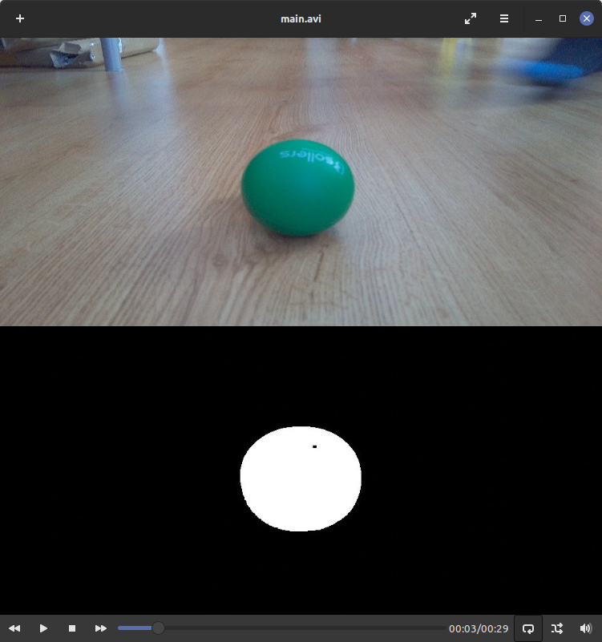

# Ball Follower


Robot made using Arduino and Nvidia Jetson Nano, RaspberryPi Camera module on servo gimbal and ultrasound sensors.

Vechicle detect round objects in specyfic color and follow it while keeping a distance. Other shapes are rejected. Ultrasound sensor stop robot from colision on front.

Communicatoion between software and firmware is made using serial.

# Development

### Environment setup

```
python -m venv <env-name>
```

### Environment activation on Windows

```
<env-name>\Scripts\activate
```

### Environment activation on Linux

```
source <env-name>\bin\activate
```

### Install dependencies

```
pip install -r requirements.txt
```

### Firmware

Firmware can be opened using PlatformIO extension.
